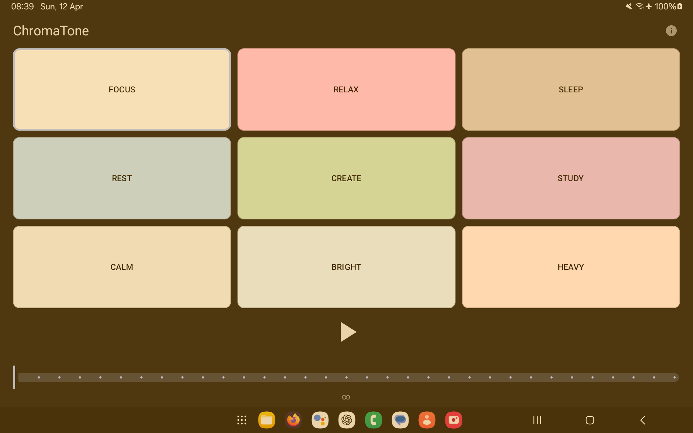

<p align="center">
  
</p>

<h1 align="center">ChromaTone</h1>

<p align="center">
  <a href="https://github.com/surendranb/chromatone/releases"></a>
  <a href="https://surendranb.github.io/chromatone/"></a>
  
  
  <a href="LICENSE"></a>
</p>

<p align="center">
  
  
  
  
  
</p>

<p align="justify">
  Minimal, battery-optimized ambient noise app for focus, sleep, and relaxation.<br>
  <b>Open source, privacy-first, and works fully offline.</b><br>
  Generate 9 different types of noise on your Android device—no ads, no tracking, no login, no network required.
</p>

---

## 🎧 What is ChromaTone?
ChromaTone generates nine scientifically recognized types of noise for different needs:
- **White Noise** (FOCUS): Balanced across all frequencies, ideal for masking distractions.
- **Pink Noise** (RELAX): More energy in lower frequencies, great for gentle relaxation.
- **Brown Noise** (SLEEP): Deep, low-frequency sound, perfect for deep sleep.
- **Blue Noise** (REST): Higher energy in upper frequencies, for alertness and clarity.
- **Green Noise** (CREATE): Mid-frequency emphasis, for creative focus.
- **Violet Noise** (STUDY): Highest-frequency, subtle sound, for study and concentration.
- **Grey Noise** (CALM): Perceptually balanced across the human hearing range.
- **Azure Noise** (BRIGHT): Sharp high-frequency emphasis for intense focus.
- **Red Noise** (HEAVY): Deepest bass profile for industrial-grade masking.

All noise is generated on-device for maximum privacy, battery efficiency, and performance. ChromaTone is designed for Android, works fully offline, and never collects or shares your data.

---

## 🚀 Quick Start

### 1. Download the Latest APK
- Go to [Releases](https://github.com/surendranb/chromatone/releases) and download the latest `app-release.apk`.
- Transfer to your Android device and install. (You may need to allow installs from unknown sources.)

### 2. Build from Source
1. **Clone the repository:**
   ```sh
   git clone https://github.com/surendranb/chromatone.git
   cd chromatone
   ```
2. **Open in Android Studio** (Giraffe or newer recommended).
3. **Build & Run:**
   - Connect your Android device (minSdk 26, Android 8.0+)
   - Click 'Run' ▶️ in Android Studio, or use the emulator.

---

## 📱 App Features
- **Minimal UI:** No clutter, just the essentials for quick access. 3x3 high-signal grid for muscle memory.
- **System Theme Sync:** Automatically follows your device's Dark or Light mode with a neutral, non-intrusive palette.
- **Timer:** Set a sleep or focus timer with a single slider. Countdown is always visible.
- **Background Playback:** Audio continues even when the app is in the background.
- **Battery Optimized:** Uses Android's foreground service for efficient playback and minimal battery drain.
- **No Ads, No Tracking:** No analytics, no network calls, no data collection—ever.
- **Tiny APK:** Under 5MB, fast to install and update.
- **Works Offline:** All noise is generated locally, no internet required.
- **No Account Needed:** No logins, no personal data.
- **Device Optimized:** Runs smoothly on all modern Android devices, including low-end phones.

---

## 🔒 Privacy & Security
- **No permissions except audio, notifications, and backup.**
- **No analytics, tracking, or network code.**
- **No data leaves your device.**
- **Open source:** Review the code any time.

---

## 🚧 Planned Features
- Additional ambient sounds: rain, ocean, wind, forest, and more
- Customizable sound mixes (combine multiple noise types or ambient sounds)
- Widget for quick access from home screen
- Scheduling (auto start/stop at set times)
- Android Auto and Wear OS support
- User feedback-driven improvements

---
## 🖼️ Screenshot

---

## 🛠️ Contributing
Contributions are welcome! Please open an issue or pull request for bug fixes, features, or suggestions.

---

## 📄 License
MIT License. See [LICENSE](LICENSE) for details.

---

## 💡 Troubleshooting
- If you can't install the APK, check your device's security settings for 'Install unknown apps.'
- For build issues, ensure you have the latest Android Studio and SDK tools.

---
